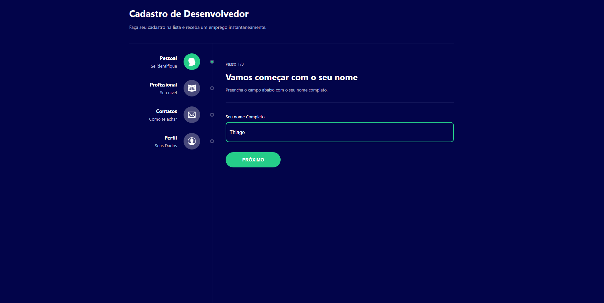

# Formulário Multi Etapas

## 	&#127919; **About**
Um Formulário de cadastro em multi etapas, com sistema interativo

## &#127775; Features
&#10004; Inputs &#10004; ContextAPI &#10004; React &#10004; TypeScript &#10004; Reducers

